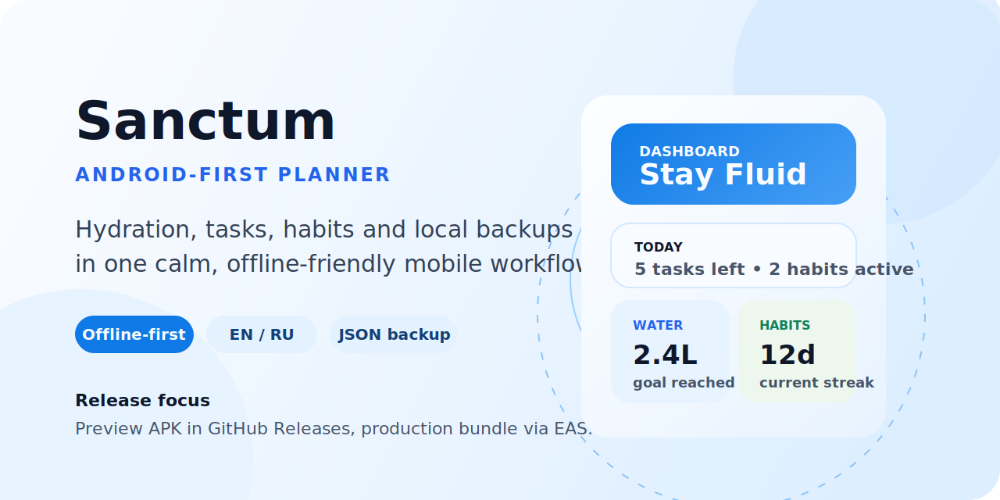

<p align="center">
  
</p>

<h1 align="center">Sanctum</h1>

<p align="center">
  Android-first planner for hydration, recurring tasks, habits and local-first backups.
</p>

<p align="center">
  
  
  
  
  
</p>

## Why This Repo Exists

Sanctum keeps the daily loop simple: drink water, track what matters today, build habits that survive real life, and keep the data on-device unless you decide to export it.

The current release scope is deliberately narrow:

- hydration tracking with quick-add controls and goal progress
- task planning with recurring rules, priorities, search and archive restore
- habit tracking with streaks, reminders and active or archived states
- local JSON export and import through a backward-compatible migration path
- English and Russian interface support

## APK Releases

Preview APKs belong in the repository's **GitHub Releases** tab, not in git history.

Release flow:

1. Run `npm run release:check`
2. Build the APK with `npx eas build --platform android --profile preview --local --output dist/Sanctum-preview.apk --non-interactive`
3. Attach `dist/Sanctum-preview.apk` to a new GitHub Release

Full release notes and the copy-ready release body live in [RELEASING.md](./RELEASING.md).

## Local Development

Requirements:

- Node.js 20+
- npm
- Android Studio / Android SDK for local Android checks

Install and run:

```bash
npm install
npm run start
```

Useful commands:

```bash
npm run android
npm run lint
npm test
npm run export:android
npm run release:check
```

## Release Checklist

1. Run the release gate and confirm it passes.
2. Verify onboarding, task creation and editing, habit reminders, hydration history, export and import on a physical Android device.
3. Confirm `app.json` version, Android package id and icons are correct.
4. Build the preview APK for GitHub Releases and the production bundle for store delivery.
5. Export local data once before destructive QA passes.

## Tech Stack

- Expo Router
- React Native 0.81
- Expo Notifications
- Expo SQLite
- Zustand
- Jest + React Native Testing Library

## Data Rules

- storage is local-first
- JSON export and import are supported
- no auth, sync or server backend is in the current release scope
